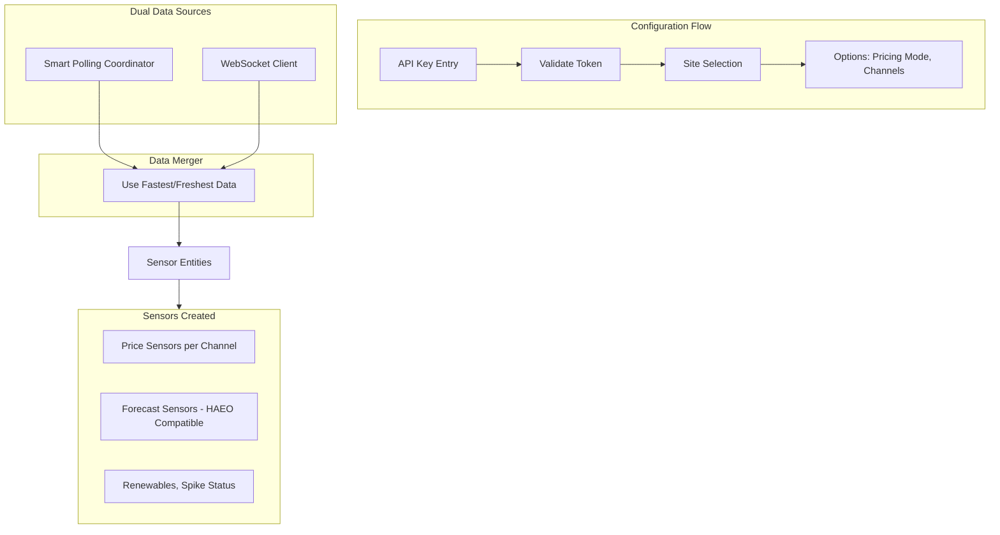

# Amber Electric Live - HACS Integration Plan

## Overview

A custom Home Assistant integration for Amber Electric that combines the simplicity of the official integration with the speed of amber2mqtt's smart polling and WebSocket redundancy. Provides HAEO-compatible sensors for energy optimization.

## Architecture



## Key Components

### 1. Config Flow (`config_flow.py`)

- **Step 1**: API token entry, validate via `amberelectric` SDK
- **Step 2**: Site selection dropdown (NMI + status)
- **Options flow**: Pricing mode (AEMO/APP), channel toggles, WebSocket enable

### 2. Smart Polling Coordinator (`coordinator.py`)

Inspired by amber2mqtt's approach:

- **Cron-based polling schedule**: Poll at specific seconds within the first 2 minutes of each 5-minute interval
- **Estimate detection**: Stop polling once `estimate=False` received for current interval
- **Rate limit awareness**: Stay within Amber's 50 requests/5min limit
- **Polling windows**: 
    - Seconds: `14,16,18,19,21,23,25,27,30,32,35,40,45,50,55`
    - Minutes: `0-1,5-6,10-11,15-16...` (first 2 mins of each 5-min block)

### 3. WebSocket Client (`websocket.py`)

Based on AmberWebSocket implementation:

- **Endpoint**: `wss://api-ws.amber.com.au`
- **Auth**: Bearer token header + subscribe message with site_id
- **Reconnection**: Exponential backoff (5s-60s) with persistent retry
- **Push updates**: Fire events and update coordinator on message receipt

### 4. Data Merger Logic

- Track last update timestamp from each source
- Use WebSocket data when available and fresh
- Fall back to polling when WebSocket is down or stale
- Polling always runs as backup (WebSocket is alpha/unreliable)

### 5. Sensors

**Per channel (general, feed_in, controlled_load):**

- `sensor.amber_live_{channel}_price` - Current price in $/kWh
- `sensor.amber_live_{channel}_forecast` - HAEO-compatible forecast sensor
- `sensor.amber_live_{channel}_descriptor` - Price descriptor (spike, high, neutral, low, etc.)

**Global:**

- `sensor.amber_live_renewables` - Grid renewables percentage
- `binary_sensor.amber_live_price_spike` - Spike indicator

**HAEO Compatibility:**

Forecast sensors include `forecasts` attribute in official Amber format:

```yaml
forecasts:
  - start_time: '2025-01-24T14:00:00+10:00'
    per_kwh: 0.28
    # or advanced_price_predicted: 0.28 based on user preference
  - start_time: '2025-01-24T14:30:00+10:00'
    per_kwh: 0.32
```

### 6. User Options

| Option | Values | Default |

|--------|--------|---------|

| Pricing Mode | `aemo` (per_kwh) / `app` (advanced_price_predicted) | `aemo` |

| General Channel | on/off | on |

| Feed-in Channel | on/off | on |

| Controlled Load | on/off | off |

| WebSocket Enabled | on/off | on |

## File Structure

```
custom_components/amber_electric_live/
├── __init__.py          # Integration setup, platforms
├── manifest.json        # HACS/HA metadata
├── config_flow.py       # Config + options flow
├── coordinator.py       # Smart polling coordinator
├── websocket.py         # WebSocket client
├── sensor.py            # Sensor platform
├── binary_sensor.py     # Binary sensor platform
├── const.py             # Constants, defaults
└── strings.json         # UI translations
```

## Dependencies

- `amberelectric>=2.0.12` - Official Amber Python SDK
- `aiohttp` - Async HTTP/WebSocket (included in HA)

## HACS Requirements

- `hacs.json` with repo metadata
- GitHub repository structure
- README with installation instructions