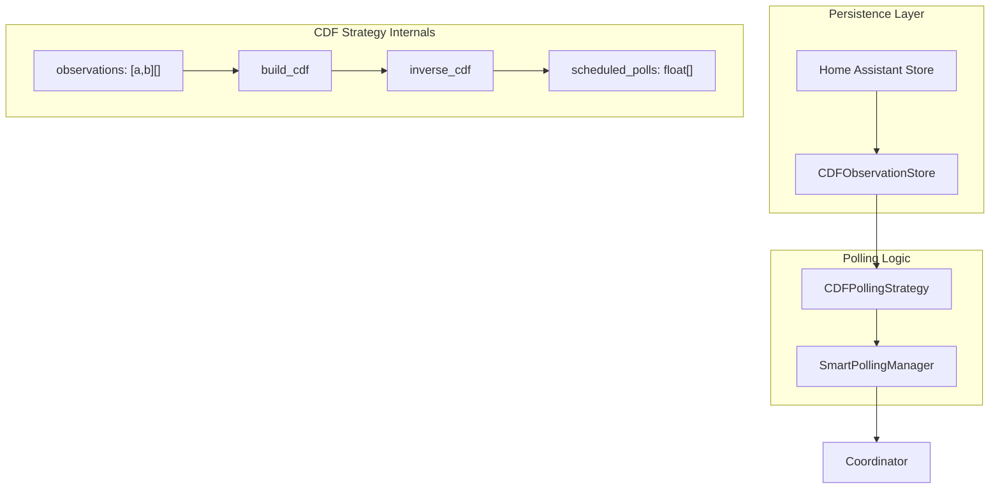

# CDF-Based Polling Strategy Implementation

## Current State

The existing [`polling_offset.py`](custom_components/amber_express/polling_offset.py) uses a simple heuristic:

- Offset-based: wait N seconds, then poll every 2-5 seconds
- Adjusts offset based on overshoot/undershoot (midpoint heuristic)

The interface with [`smart_polling.py`](custom_components/amber_express/smart_polling.py):

- `start_interval()` - reset state for new 5-min window
- `record_confirmed(last_estimate_elapsed, confirmed_elapsed)` - observation recorded
- `should_poll_for_confirmed(elapsed_seconds) -> bool` - poll decision
- `get_stats()` - diagnostics

## New Strategy Design

### Core Algorithm

1. **Observation storage**: Each observation is an interval `[a, b]` where:

   - `a` = time of last poll that returned estimate
   - `b` = time of first poll that returned confirmed
   - The event (confirmed price availability) occurred somewhere in `[a, b]`

2. **CDF construction** (computed on observation updates):

   - Collect all unique endpoints from the N most recent intervals
   - Sort to form a time grid `[t_0, t_1, ..., t_m]`
   - For each segment `[t_j, t_{j+1}]`, compute slope as sum of contributing densities
   - Integrate via trapezoidal rule to get cumulative CDF
   - Normalize so `F(300) = 1`

3. **Poll scheduling** (computed once per interval):

   - Target probabilities: `p_j = j/(k+1)` for `j = 1..k`
   - Compute poll times via inverse CDF: `t_j = F^{-1}(p_j)`
   - Store as sorted list of scheduled poll times

4. **Decision logic**: `should_poll_for_confirmed(elapsed)` returns `True` if elapsed time has reached the next scheduled poll time

### Parameters (hardcoded constants)

- **N = 100**: Rolling window of observations (balances memory vs learning)
- **k = 4**: Polls per window (divides probability into 5 equal regions)

### Cold Start Behavior

On first run (no persisted data), initialize with N=100 synthetic intervals of `[15, 45]`. These get naturally pushed out as real observations come in through the normal rolling window logic. No special-case minimum threshold - the algorithm always operates uniformly on whatever observations exist.

### Persistence

Use Home Assistant's `Store` class to persist interval observations:

- Key: `amber_express.cdf_observations.{entry_id}`
- Data: List of `[a, b]` pairs (most recent N)
- Load on startup, save after each new observation

## File Changes

### 1. New file: `cdf_polling.py`

Core classes:

- `IntervalObservation`: TypedDict for `{"start": float, "end": float}`
- `CDFPollingStrategy`: Main implementation
  - `_observations: list[IntervalObservation]` - rolling window
  - `_scheduled_polls: list[float]` - computed poll times for current interval
  - `_polls_executed: int` - track which polls have been used

Key methods:

- `start_interval()` - compute scheduled polls from current CDF
- `record_observation(start, end)` - add to observations, recompute CDF
- `should_poll_for_confirmed(elapsed) -> bool` - check against schedule
- `_build_cdf()` - construct piecewise linear CDF from intervals
- `_compute_poll_schedule()` - inverse CDF sampling

### 2. New file: `cdf_storage.py`

Persistence layer:

- `CDFObservationStore`: Wraps Home Assistant `Store`
- `async_load() -> list[IntervalObservation]`
- `async_save(observations: list[IntervalObservation])`

### 3. Modify: `smart_polling.py`

- Replace `PollingOffsetTracker` with `CDFPollingStrategy`
- Inject store via dependency (for async load/save)
- Update stats dataclass for new diagnostic info

### 4. Modify: `__init__.py`

- Initialize `CDFObservationStore` with config entry ID
- Pass store to `SmartPollingManager`
- Handle async load on setup

### 5. Delete: `polling_offset.py`

Replace entirely with new implementation.

## Architecture Diagram

## Tests

- Unit tests for CDF construction with known intervals
- Unit tests for inverse CDF computation
- Integration tests for persistence round-trip
- Tests for cold start initialization (100 synthetic intervals)
- Tests for poll scheduling decisions
